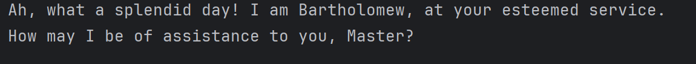

# Bartholomew User Guide



Bartholomew is your **refined and sophisticated task assistant**, designed to help you manage tasks efficiently while maintaining an air of elegance.  
With Bartholomew, you can add events, deadlines, and To-Do tasks to your list. You can also mark and unmark tasks as done, as well as find and list tasks seamlessly. Whether it's a simple todo, an event, or a deadline, Bartholomew is at your service!

## Adding deadlines

You may add **deadlines** for tasks that must be completed by a certain time.

Example: `deadline study /by 11pm`

```
Splendid choice, Master! I have dutifully added the following task to your registry:
  [D][ ] study (by: 11pm)
```

## Adding Tasks

You can add a To-Do task that requires no specific deadline.

Example: `todo read book
`

```
Excellent selection! I have recorded this task for you:
  [T][ ] read book
```

## Adding Events

You can add event-based tasks that occur at a specific time.

Example: `event team meeting /from 1pm /to 3pm`

```
Splendid choice, Master! I have dutifully added the following task to your registry:
  [E][ ] team meeting (from: 1pm to: 3pm)
```

## Listing Tasks

To view all tasks in your list.

Example: `list
`
```
Very well, here is the current inventory of your esteemed tasks:
1. [D][ ] study (by: 11pm)
2. [T][ ] read book
3. [E][ ] team meeting (from: 1pm to: 3pm)
A total of 3 tasks reside in your list.
```

## Marking Tasks as Done

Once a task is completed, you may mark it as done.

Example: `mark 1`
```
Magnificent, Master! I have marked this task as completed:
  [D][X] study (by: 11pm)
```

## Unmarking Tasks as Done

You may also unmark it!

Example: `unmark 1`
```
Understood, Master. I have restored this task to its incomplete status:
  [D][ ] study (by: 11pm)
```

## Deleting Tasks

You may remove an unnecessary task from the list.

Example: `delete 1`
```
As per your request, I have removed this task:
  [D][ ] study (by: 11pm)
Now, your inventory of tasks stands at 2.
```
## Searching for Tasks

You can search for tasks using a keyword.

Example: `find meetiing`
```
Here are the matching tasks in your list:
1. [E][ ] team meeting (from: 1pm to: 3pm)
```

## Exiting Bartholomew

When you wish to conclude your session with Bartholomew.

Example: `bye`
```
Farewell, Master. I wish you a most delightful rest of your day.
```

`----------------------------------------------------------------------------------------------------`

With Bartholomew, task management is no longer a daunting task! Let Bartholomew be the Task Assistant for you!